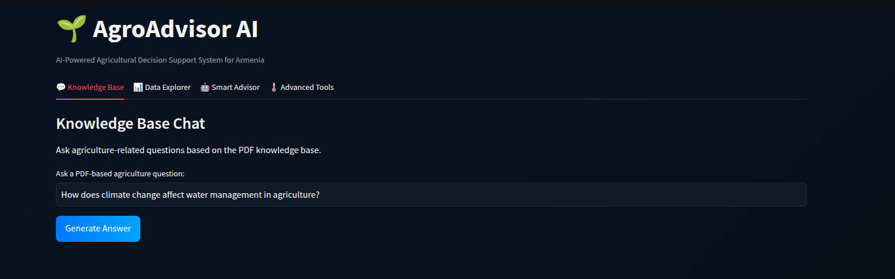
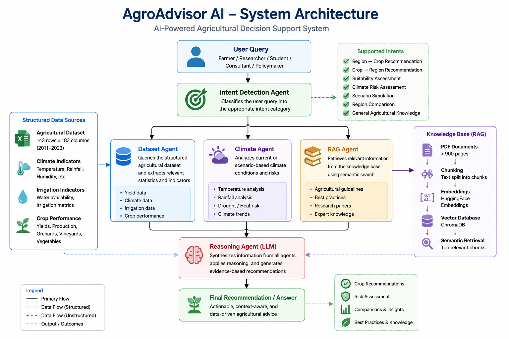
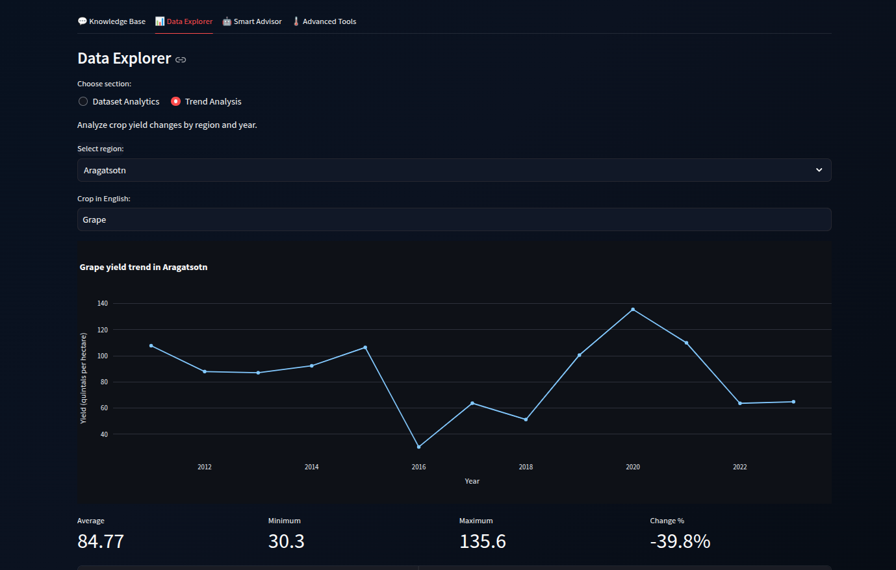
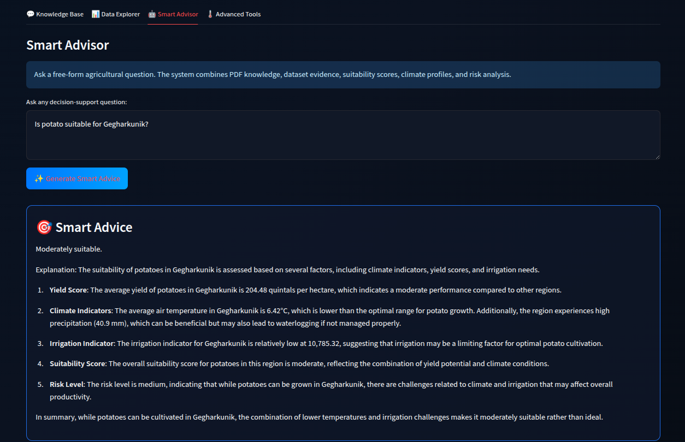
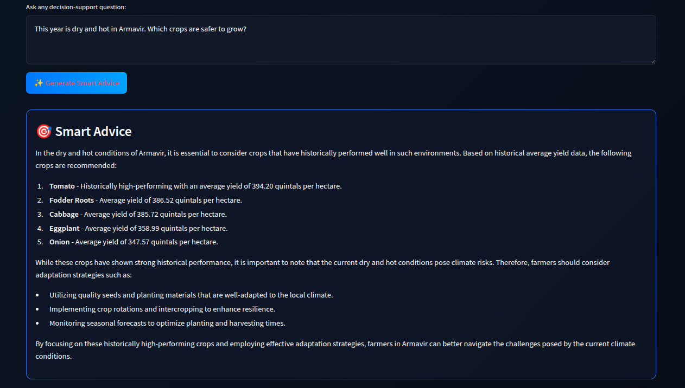
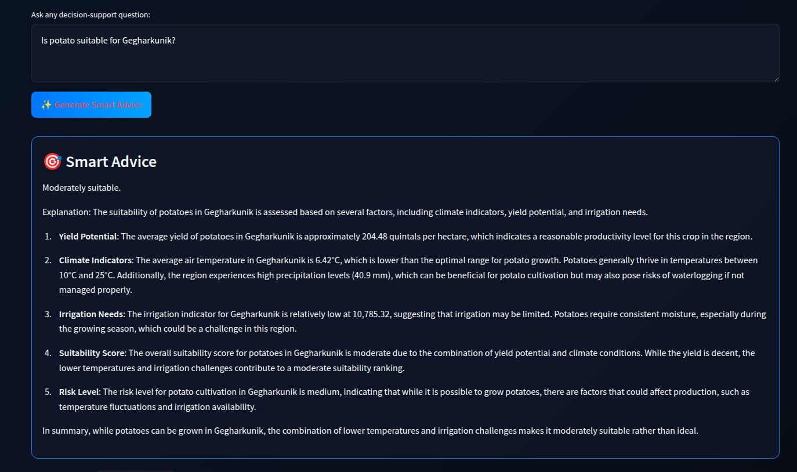

# AgroAdvisor AI
### AI-Powered Agricultural Decision Support System for Armenia



---

## Overview

AgroAdvisor AI is an intelligent agricultural decision-support system designed for Armenia.

The system combines:

- Large Language Models (LLMs)
- Retrieval-Augmented Generation (RAG)
- Agricultural datasets
- Climate indicators
- Historical crop performance statistics
- Knowledge extracted from agricultural reports and scientific documents

to provide evidence-based recommendations for farmers, agricultural consultants, researchers, students, and policymakers.

Unlike traditional agricultural chatbots that rely only on document retrieval, AgroAdvisor AI integrates both structured agricultural statistics and unstructured expert knowledge to support real-world agricultural decision making.

---

## Problem Statement

Agricultural decision making has become increasingly difficult due to:

- Climate variability
- Water scarcity
- Changing rainfall patterns
- Crop suitability uncertainty
- Limited access to agronomic expertise
- Fragmented information sources

Farmers often need answers to questions such as:

- Which crop should I cultivate in my region?
- Is a specific crop suitable for local conditions?
- Which Armenian region is best for a given crop?
- What risks should I consider under drought or heat stress?
- How does climate-smart agriculture improve resilience?

Finding reliable answers typically requires consulting multiple reports, datasets, and experts.

AgroAdvisor AI addresses this challenge by integrating agricultural statistics, climate indicators, and expert knowledge into a single intelligent assistant.

---

## Target Users

### Farmers

Receive crop recommendations based on historical performance and climate indicators.

### Agricultural Consultants

Support advisory activities with data-driven recommendations.

### Researchers

Analyze relationships between climate conditions and crop productivity.

### Students

Learn about agricultural analytics and climate-smart agriculture.

### Policymakers

Explore regional agricultural patterns and identify development opportunities.

---

# System Architecture




The system follows a multi-agent decision-support architecture.

```text
User Question
        │
        ▼
Intent Detection Agent
        │
 ┌──────┼──────┐
 ▼      ▼      ▼
Dataset Climate  RAG
 Agent   Agent  Agent
        │
        ▼
Reasoning Agent (GPT-4o-mini)
        │
        ▼
Final Recommendation
```

### Components

#### Intent Detection Agent

Identifies the user's objective:

- Region → Crop Recommendation
- Crop → Region Recommendation
- Suitability Assessment
- Climate Risk Assessment
- Scenario Simulation
- Region Comparison
- Agricultural Knowledge Retrieval

#### Dataset Agent

Analyzes structured agricultural statistics.

#### Climate Agent

Evaluates climatic conditions and environmental risks.

#### RAG Agent

Retrieves relevant information from agricultural PDF documents.

#### Reasoning Agent

Combines all retrieved evidence and generates the final recommendation.

---

# Agricultural Dataset

The agricultural dataset contains historical statistics from Armenia.

| Metric | Value |
|----------|----------|
| Rows | 143 |
| Columns | 183 |
| Regions | 10 |
| Years | 2011–2023 |

The dataset includes:

### Climate Indicators

- Irrigation indicators
- Relative humidity
- Atmospheric pressure
- Precipitation
- Average temperature

### Crop Statistics

- Wheat
- Barley
- Potato
- Tomato
- Onion
- Carrot
- Cabbage
- Beetroot
- Grapes
- Fruit crops
- Vegetable crops

### Agricultural Production Indicators

- Sown area
- Harvested area
- Yield per hectare
- Total production volume

---

# Knowledge Base (RAG)

The knowledge base contains agricultural and climate-related reports.

### Pipeline


```text
PDF Documents
      │
      ▼
Chunking
      │
      ▼
Embeddings
      │
      ▼
Chroma Vector Database
      │
      ▼
Semantic Search
      │
      ▼
Relevant Context
      │
      ▼
GPT Response
```

### Technologies

- LangChain
- ChromaDB
- HuggingFace Embeddings
- OpenAI GPT-4o-mini

---

# Data Analytics

The system allows exploration of agricultural performance indicators.

Capabilities:

- Top-performing regions
- Crop yield rankings
- Historical trends
- Climate indicators
- Region comparisons



Example:

```text
Top regions for grape cultivation
Top regions for potato cultivation
Historical grape yield trends
```

---

# Smart Advisor

Smart Advisor combines:

- Dataset analytics
- Climate indicators
- Historical crop performance
- Knowledge base evidence

to provide actionable recommendations.



Example question:

```text
Which region is best for growing grapes in Armenia?
```

Example output:

```text
Ararat is the most suitable region due to:

- Highest average yield
- Favorable climate
- Strong irrigation indicators
- High suitability score
```

---

# Climate Risk Assessment

The system evaluates agricultural risks under challenging climate conditions.

Supported scenarios:

- Drought
- Heat stress
- Water limitations
- Reduced rainfall
- Climate variability



Example:

```text
This year is dry and hot in Armavir.
Which crops are safer to grow?
```

The system combines historical performance data with climate-smart agricultural practices extracted from the knowledge base.

---

# Crop Suitability Analysis

The system determines whether a crop is suitable for a specific region.

Example:

```text
Is potato suitable for Gegharkunik?
```

The recommendation considers:

- Historical yield
- Climate similarity
- Irrigation indicators
- Risk assessment



### Suitability Formula

```text
Final Suitability Score =
60% Yield Score
25% Climate Score
15% Water Score
```

Outputs:

- Suitability Score
- Risk Level
- Explainability
- Climate Match

---

# Region Comparison

The system can compare multiple regions for crop cultivation.

Example:

```text
Compare Ararat and Armavir for grape production.
```

Comparison factors:

- Yield
- Climate indicators
- Water indicators
- Suitability score
- Risk level

---

# Climate-Smart Agriculture Support

The knowledge base includes climate-smart agriculture resources.

Example questions:

```text
What is climate-smart agriculture?

How does climate change affect water management?

How can farmers adapt to drought?
```

The system retrieves relevant scientific evidence and combines it with regional agricultural data.

---

# Example Questions

### Region Recommendation

```text
Which region is best for growing grapes in Armenia?
```

### Crop Recommendation

```text
I live in Shirak. What crops can I cultivate?
```

### Suitability Assessment

```text
Is potato suitable for Gegharkunik?
```

### Climate Risk Assessment

```text
This year is dry and hot in Armavir.
Which crops are safer to grow?
```

### Knowledge Retrieval

```text
What is climate-smart agriculture?
```

---

# Evaluation

The system was evaluated using a benchmark set of agricultural questions.

### Evaluation Categories

- Crop Recommendation
- Region Recommendation
- Suitability Assessment
- Climate Risk Assessment
- Knowledge Retrieval

### Results

| Metric | Value |
|----------|----------|
| Evaluation Questions | 10 |
| Automated Accuracy | 90% |

The evaluation demonstrates that the system can reliably answer agricultural decision-support questions using both structured and unstructured knowledge sources.

---

# Technologies Used

## AI & LLM

- OpenAI GPT-4o-mini

## Retrieval-Augmented Generation

- LangChain
- ChromaDB
- HuggingFace Embeddings

## Frontend

- Streamlit

## Data Processing

- Pandas
- NumPy
- OpenPyXL

## Knowledge Sources

- Agricultural PDFs
- Climate-smart agriculture reports
- Armenian agricultural statistics

---

# Limitations

Current limitations include:

- Historical irrigation indicators do not guarantee current water availability.
- Soil quality data is not included.
- Future yield forecasting is not implemented.
- Recommendations should be validated through local field assessments.

---

# Future Work

Planned improvements:

- Soil data integration
- Weather API integration
- Satellite imagery analysis
- Multi-agent orchestration
- Crop profitability analysis
- Advanced climate adaptation modeling
- Real-time climate monitoring

---

# Responsible AI

AgroAdvisor AI is intended as a decision-support tool.

The system:

- Provides evidence-based recommendations
- Cites supporting information
- Communicates uncertainty
- Does not replace professional agronomic consultation

Users should validate recommendations through local agricultural experts before making major production decisions.

---

# Author

**Sergey Hayrapetyan**

Master's Project – Large Language Models Applications

Yerevan State University

---

## AgroAdvisor AI

Combining Large Language Models, Retrieval-Augmented Generation, agricultural analytics, and climate-smart agriculture knowledge to support evidence-based agricultural decision making in Armenia.
